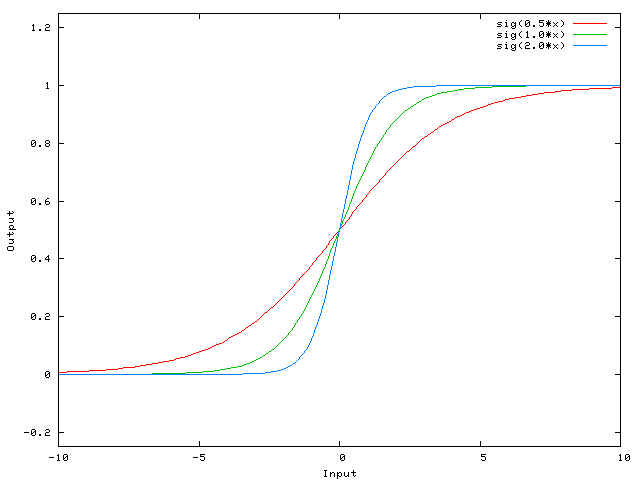

# Neural Networks
In this repository, I try to summarize and gather from notes and codes while I am learning about neural networks.

I started to know what the real story is in this field by watching [this](https://www.youtube.com/watch?v=ntKn5TPHHAk) on YouTube, which gave me a general idea summarized in the following concise summary.

This field of computer science tries to mimic the process happening in our brains to be able to build softwares that can be intelligent and also be able to do what our brains do. Our brains are far better than modern computers in some types of computations like pattern recognition or approximate guessing.

The very first step in this journey is to understand how a single neuron in our brains works, then try to model it to be able to implement them in an artificial way. Actually, we can look at every neuron like a function that its inputs have weights entering it, then the neuron itself has a computation formula, which based on it, produces an output. Additionally, this single neuron based on the desired output (in supervised learning, where we provide desired output for a set of inputs in training phase) and its produced one tries to change the weights of inputs which they are multiplies entering the main function. To go deeper inside, there is an activation function inside the neuron that conforms the output of aggregation of inputs multiplied by their weights to the desired range. For example, if we want to classify an input (a point), so we can use just a function like: **F(X) = u(t) - u(-t)** in which **u(t)** is a step function (**u(t) = 0 for t < 0 and = 1 for x >= 0**). In the following figure, we can see what we talked about it.


But, what is the bias?
Bias is for shifting the activation function in a way that it may be impossible just by changing the weights (when inputs are zero). Look at the following figures consecutively, you will catch it:





[Here](code/01-giving_idea/neuron.py), you can look at a very simple neuron.

In the training process (in a supervised learning), the neuron has access the answer and its generated result. So, based on the difference between the answer and the produced result (called error), it tries to update the weights (w0 = w0 + delta(w0)). The process that changes the weights is called **gradient descent**.
```
delta(w) = error * input

new weight = weight + error * input
```
---
# ML by Andrew Ng
Then, I came up with the idea of watching Machine Learning tutorial by Andrew Ng, which is available on YouTube. I will summarize what I learn in the simplest way with doing exercises in octave and a try to implement them in python.

[Arthur Samuel](https://en.wikipedia.org/wiki/Arthur_Samuel) (1959) defines ML as: "Field of study that gives computers the ability to learn without being explicitely programmed."

[Tom Mitchel](https://en.wikipedia.org/wiki/Tom_M._Mitchell) (1998) defines a well-posed learning problem as: "a computer program is said to learn from experience E with respect to some task T and some performance measure P. If its performance on T, as measured by P, improves with experience E"

(Example for Tom Mitch's definition) Supposing an email program learning from our labeling emails as spam:
- (Task): Classifying emails as spam or not spam
- (Experience): Observing our labels as spam or not
- (Performance): The number of emails correctly classified

ML learning algorithms:
- Supervised Learning (Regression (continuous values like price prediction), Classification (discrete values like yes/no classification)) | Right answer is told to the machine
- Unsupervised learning (Clustering, Google news, organizing computing clusters, social network analysis, market segmentation, astronomical data analysis, cocktail party algorithm)
- Reinforcement Learning
- Recommender Systems

---

### Logistic Regression
Logistic regression is an algorithm for binary classification.

For stroing an image, computers store three matrices: Blue, Green, Red, corresponding to the color channels of the image. A feature vector is built by sequencing rows of these matrices. In the following figure, you can see how it occurs.


In a binary classification, the goal is to learn a classifier that can input an image represented by a feature vector, and predict whether the corresponding label is 1 or 0. The example can be a cat classifier which classifies cats from non-cats.

A single training example is represented by a pair (x, y) where x is an n-dimensional feature vector, and y, the label, is either 0 or 1.

Training sets comprise m training examples. In the following figure, the notation is shown.


The logistic regression can be found in the following figure. The activation function, sigmoid, is also descirbed.


When logistic regression is implemented, the main job is to learn parameters **w** and **b** so that the desired probability function becomes a good estimate of the chance of y being equal to one.

To train the parameters **w** and **b** of the logistic regression model, you need to define a **cost function**.


The goal is to find **w** and **b** to minimize **J(w,b)**.
### Gradient Descent
In the following figure, the concept of gradient descent is described with one-variable function.


Backpropagation can be figure out with the following figure.


The backpropagation of logistic regression on its computation graph.


The derivative calculation of sigmoid function is provided in the following figure.


Now, we want to extend our formulas and equations to m training examples:


But, as it is apparent it is not efficient (because of so many iterantions on arrays). The technique which helps us here to improve the effictiveness of gradient descent is **vectorization**.


The following figure shows how vectorizarion using **numpy** in python can be more efficient. From [here](code/1-NN_DL_Basics_season/vectorization_in_python_with_numpy_lib.ipynb) you can have the source code.


The reason why numpy performs efficiently is that it uses CPU's SIMD units for its calculations.

In neural networks programming, whenever possible, avoid explicit for loops. The following figure shows two examples.


Other functions of numpy that perform a secific operation on all elements of a vector.

- np.log(v)
- np.abs(v)
- np.max(v, 0)
- v**2 : the result is a vector which each element of it is square of the corresponding element of v
- 1/v

The following slide shows how we get rid of one of the for loops in logistic regression.


It can be further vectorized as follows:


